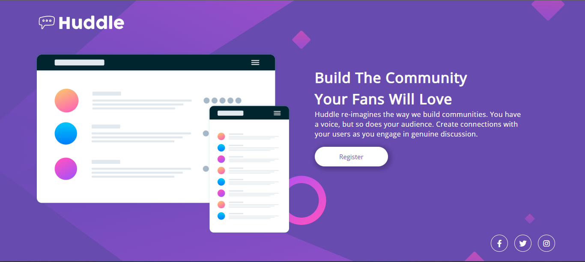
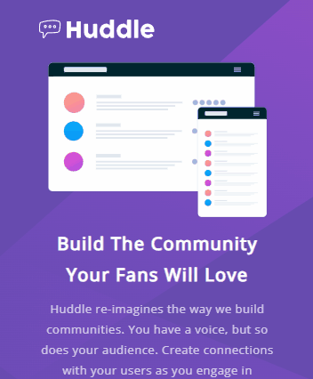

<h1 align="center">Huddle Landing Page</h1>

<p align="center">
  Exercício *html - css avançado*, é uma landing page requerida pela quest do exercício em que precisa-se deixar o mais semelhante possivel ao design original.
</p>




## Tecnologias Usadas

  - HTML
  - CSS

## Funcionalidades

Nenhuma, somente interação com botões com hover, porém não há caminho, link ou direcionamento nos botões.

## Aprendizado 

Este projeto teve uma dificuldade mediana para mim, porém eu demorei bastante tempo para concluilo, compreendo que meu código não está dos melhores, tentei fazer o mais fidedigno possível e ao meu ver eu obtive êxito. A parte mais complicada para mim foi o responsivo e o html, o responsivo não ficou muito bom e com o código do html fraco, atrapalhou o responsivo. Não sei se ficou tão ruim assim, tive certas dificuldades em relação a isso. 

## Instalação

Forneça instruções detalhadas sobre como instalar seu projeto. Inclua os comandos necessários e informações sobre pré-requisitos, se houver.

```bash
# Clone o repositório
git clone https://github.com/Bruno-nog/huddle-landing-page.git

# Navegue até o diretório do projeto
cd huddle-landing-page/

# Instale as dependências
npm install
```
